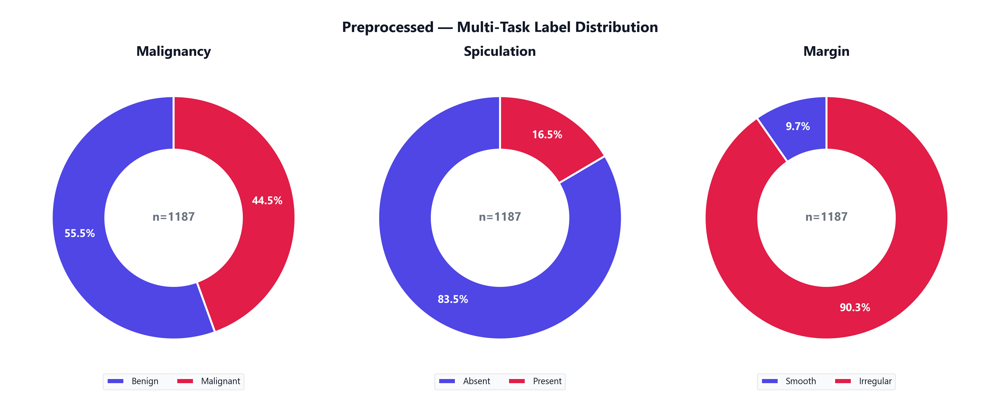
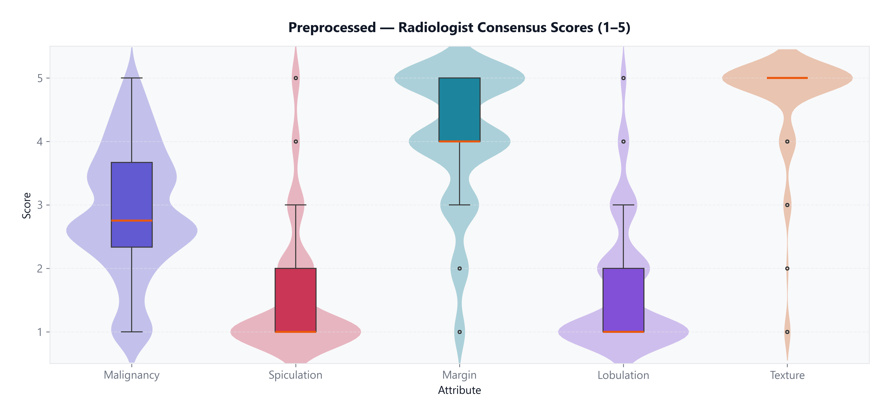

# LIDC-IDRI Dataset Report — Classification

**Phase:** CRISP-ML(Q) — Dataset Development  
**Task:** Benign vs malignant (+ spiculation, margin)

## Raw Data (`output/LIDC-IDRI/raw_data/`)

- Source: LIDC-IDRI DICOM via pylidc (downloaded patient subset)
- See `raw_cohort_overview.png`, `data_statistics.csv`

## Preprocessed Data (`output/LIDC-IDRI/preprocessed_data/`)

| Statistic | Value |
|-----------|-------|
| Patients | 638 |
| Patches | 1187 |
| Mean diameter | 12.30 mm |

### Labels

- Malignancy: 659 benign / 528 malignant
- Spiculation: 991 absent / 196 present
- Margin: 115 smooth / 1072 irregular

### Clinical scores & size

- Micro (<3mm): 0.0% | 3–10mm: 56.0% | >10mm: 44.0%

### Split

Train / Val / Test patches: 822 / 190 / 183

## Data Quality

- Patient-level split prevents leakage
- Duplicate annotations merged (5 mm spatial matching)
- Indeterminate malignancy score (3) excluded during preprocessing
