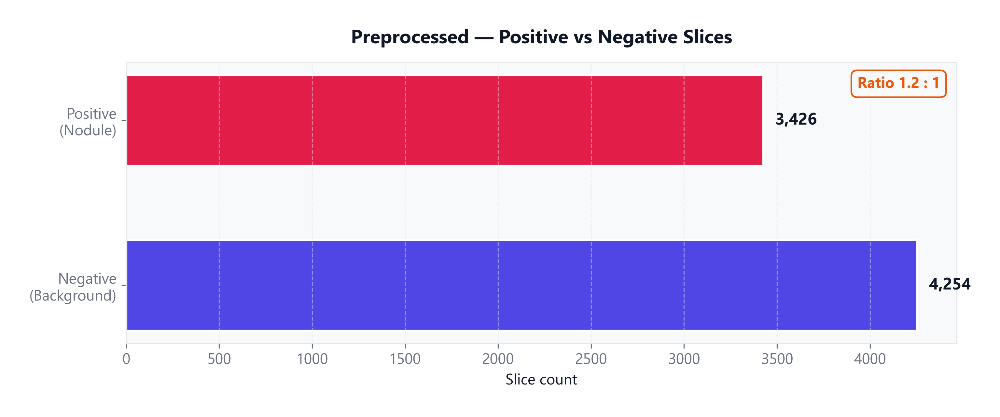
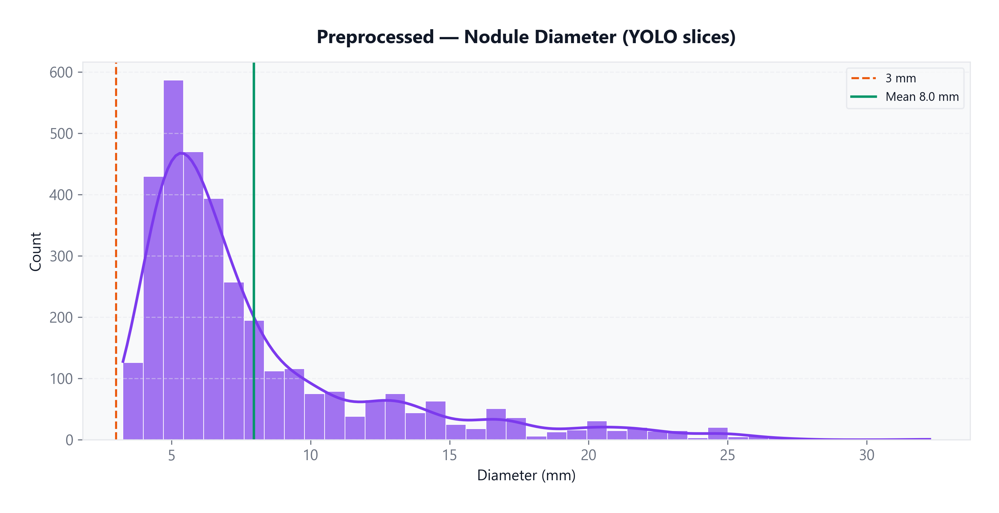
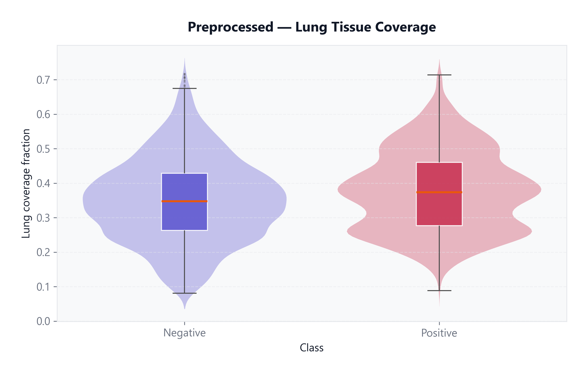

# LUNA16 Dataset Report — Detection (YOLO)

**Phase:** CRISP-ML(Q) — Dataset Development  
**Task:** Pulmonary nodule detection on 2.5D slices

## Raw Data (`output/luna16/raw_data/`)

- Source: LUNA16 challenge subsets (`.mhd` volumes + `annotations.csv`)
- See `nodule_diameter_distribution.png`, `scans_per_subset.png`, `data_statistics.csv`

## Preprocessed Data (`output/luna16/preprocessed_data/`)

| Statistic | Value |
|-----------|-------|
| CT scans (series) | 601 |
| 2.5D slices | 7680 |
| Positive slices | 3426 |
| Negative slices | 4254 |
| Imbalance ratio | 1.2 : 1 |
| Mean nodule diameter | 7.96 mm |

### Train / Val / Test

- Train: 5547 | Val: 913 | Test: 1220

### Class imbalance

### Nodule size & lung coverage

## Data Quality Notes

- Scan-level split (subsets 0–7 train, 8 val, 9 test) prevents patient leakage
- HU window [-1000, 400] and lung masking applied during preprocessing
- Corrupted `.mhd` files skipped per audit log in `data/luna16_yolo_dataset_v4/audit/`
