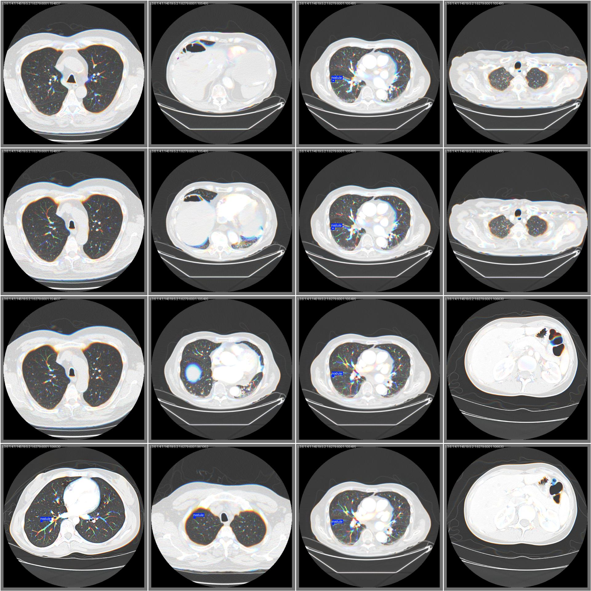
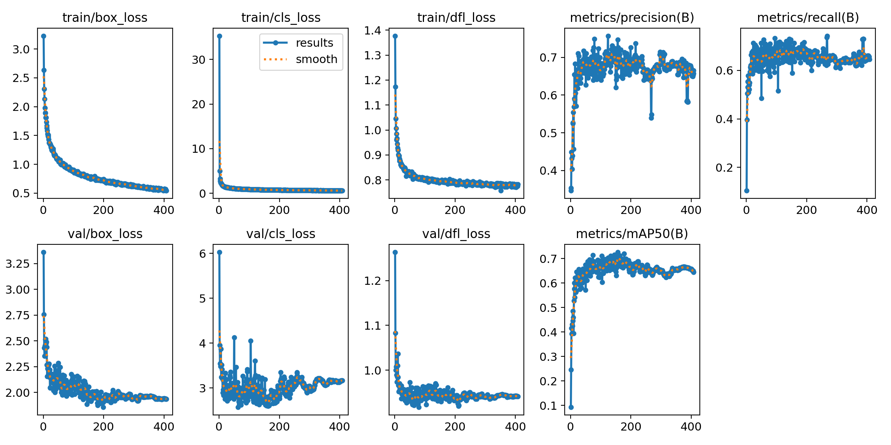

# 🫁 Early-Stage Lung Cancer Detection & Classification - MLOps Pipeline

End-to-End Deep Learning project for detecting and assessing the malignancy risk of pulmonary nodules directly from DICOM CT scans.

---

## 🌐 Live Deployment

### 🖥️ React (UI)

- **URL**: http://lung-frontend-app.spaincentral.azurecontainer.io:8080


---

## 📊 Project Overview

This project builds and serves a two-stage computer vision pipeline:
- **Stage 1 (Detection):** YOLOv8m custom-trained on 2.5D slices to locate nodules.
- **Stage 2 (Classification):** R(2+1)D Dual-Attention 3D CNN to classify nodule malignancy.
- Integrated into a FastAPI backend and a React frontend.

---

## 🛠️ Tech Stack

| Layer                  | Tool / Library                |
|------------------------|-------------------------------|
| **Programming**        | Python 3.10, JavaScript       |
| **Detection Model**    | Ultralytics YOLOv8 (PyTorch)  |
| **Classification Model**| R(2+1)D (PyTorch)             |
| **Data Processing**    | Pydicom, SimpleITK, OpenCV    |
| **Backend API**        | FastAPI, Uvicorn              |
| **Frontend UI**        | React                         |
| **MLOps & Deployment** | Docker, DVC, Azure Blob Storage|

---

## 📁 Project Structure

```text
CRISP-ML(Q)/
├── .dvc/                               # Data Version Control config (Azure remote)
├── 01_Business_and_Data_Understanding/ # EDA, project scoping, & analysis reports
├── 02_Model_Development/
│   ├── data_engineering/               # Preprocessing pipelines (LUNA16, LIDC)
│   ├── ml_model_engineering/           # Training scripts & model weights (*.pt)
│   └── ml_model_evaluation/            # Metrics, plots, & confusion matrices
├── 03_Model_Operations/
│   ├── deployment/                     # Production codebase
│   │   ├── api.py                      # FastAPI Backend
│   │   └── frontend/                   # React/Vite UI
│   └── monitoring_and_maintenance/     # Drift detection, logging & alerts
├── data/                               # DVC-tracked data (ignored by Git)
│   ├── classification_dataset.dvc      # R(2+1)D training data pointer
│   ├── luna16_yolo_dataset_v4.dvc      # YOLOv8 training data pointer
│   ├── monitoring/                     # Production prediction logs & baselines
│   └── labeled/                        # User-verified DICOMs & labels
├── docker-compose.yml                  # Multi-container orchestration
├── Dockerfile                          # Backend container
├── requirements.txt                    # Clean production API deps
└── README.md
```

---

## 🚀 Quickstart (Docker / Recommended)

The easiest way to run the entire MLOps pipeline locally is using Docker Compose.

### 1. Clone the repository & Pull Data

```bash
git clone "https://github.com/omar22kormadi/lung-nodule-mlops.git"
cd "lung-nodule-mlops/CRISP-ML(Q)"

# Pull the heavy datasets and model weights from Azure Blob Storage
dvc pull
```

### 2. Run with Docker Compose

```bash
docker-compose up --build
```

- **Frontend UI:** http://localhost:8080
- **Backend API:** http://localhost:8000/docs

*(Note: The first run downloads ~400MB of PyTorch CPU dependencies. To use the GPU version, comment out the CPU flag in `requirements.txt`).*

---

## 💾 Data & Model Versioning (DVC)

Because medical datasets (DICOM) and model weights (`.pt`) are massive, they are strictly versioned using **Data Version Control (DVC)** and hosted securely on **Azure Blob Storage**.

As the Dockerized app runs, user-verified CT scans are automatically saved to the persistent `data/labeled/` volume. To version this new data and push it to Azure for future retraining:

```bash
dvc add data/labeled data/monitoring
git add data/labeled.dvc data/monitoring.dvc
git commit -m "Tracking new user-labeled scans"
dvc push
git push
```

---

## 🛠️ Quickstart (Manual)

### 2. Start the API (FastAPI)

```bash
cd "03_Model_Operations/deployment"
# Run using the batch file:
start_api.bat

# OR run manually:
uvicorn api:app --host 0.0.0.0 --port 8000 --reload
```
- API Docs: http://127.0.0.1:8000/docs

### 3. Start the UI (React)

Open a **new** terminal:
```bash
cd "03_Model_Operations/deployment/frontend"
npm install

# Run using the batch file:
start_frontend.bat

# OR run manually:
npm run dev
```
- UI: http://localhost:8080 (or `5173`)

Upload a complete DICOM study (10+ slices) to view the bounding boxes, risk assessment, and interactive 3D lung reconstruction!

---

## ☁️ Azure Deployment

The project is deployed to **Azure Container Instances** (region: Spain Central) with a persistent **Azure File Share** for labeled DICOM storage:

- **Frontend UI:**
  - Image: `lungnoduleacr.azurecr.io/frontend:latest`
  - Public interface: http://lung-frontend-app.spaincentral.azurecontainer.io:8080

- **Backend API:**
  - Image: `lungnoduleacr.azurecr.io/backend:latest`

Both containers are configured with:
- Public IP and DNS name labels (Spain Central region)
- Persistent Azure File Share (`lung-app-data`) mounted to `/app/data`
- CPU inference (no GPU required)

---

## ✅ Implemented Features

- [x] DICOM preprocessing pipelines (LUNA16 & LIDC-IDRI)
- [x] 2.5D YOLOv8m nodule detection (mAP@50: 0.708)
- [x] R(2+1)D Dual-Attention 3D CNN classification (AUC: 0.953)
- [x] Interactive React 3D CT viewer with Three.js
- [x] Human-in-the-loop labeling pipeline (save verified scans)
- [x] Data versioning with DVC + Azure Blob Storage
- [x] Production monitoring & drift detection
- [x] Dockerized backend & frontend
- [x] Local Docker Compose orchestration
- [x] Azure Container Instances deployment (CPU inference)

---


## 📈 Visual Results & Model Performance

### Ground Truth vs. Predictions (2.5D YOLOv8m)
*Notice how the model successfully isolates pulmonary nodules, ignoring complex anatomical distractors such as blood vessels and airways.*

| Ground Truth (Expert Annotations) | Model Predictions (YOLOv8m) |
|:---:|:---:|
|  |  |

### Training Convergence & Metrics
The training curves demonstrate exceptional stability. The 2.5D spatial context combined with the optimal SGD learning rate allowed the detection model to steadily drive down bounding box and classification losses while pushing `mAP@50` smoothly above 0.70.

<p align="center">
  
</p>

### Final Metrics

| Stage | Model | Task | Key Metric | Value |
|-------|-------|------|------------|-------|
| **Detection** | YOLOv8m (2.5D) | Bounding Box | mAP@50 | **0.708** |
| **Detection** | YOLOv8m (2.5D) | Bounding Box | Precision | **0.737** |
| **Classification**| R(2+1)D Dual-Attention | Binary Malignancy | ROC-AUC | **0.953** |
| **Classification**| R(2+1)D Dual-Attention | Binary Malignancy | Sensitivity | **0.927** |

---

## 👤 Author

- **Name**: Amor Kormadi 
- **Email**: amor.kormadi@polytechnicien.tn 
- **Project**: CRISP-ML(Q) Pipeline for Pulmonary Nodule Detection and Classification 